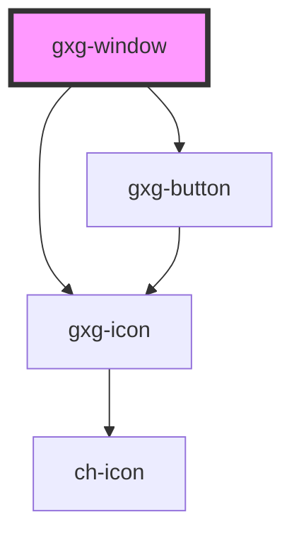

# gxg-window

<!-- Auto Generated Below -->

## Properties

| Property        | Attribute        | Description                                                               | Type      | Default   |
| --------------- | ---------------- | ------------------------------------------------------------------------- | --------- | --------- |
| `displayWindow` | `display-window` | Displays the window                                                       | `boolean` | `false`   |
| `initialHeight` | `initial-height` | The window starting height                                                | `string`  | `"200px"` |
| `initialWidth`  | `initial-width`  | The window starting width                                                 | `string`  | `"360px"` |
| `leftPosition`  | `left-position`  | The window left position. By default the window is horizontally centered. | `string`  | `"0px"`   |
| `maxHeight`     | `max-height`     | The window max. height                                                    | `string`  | `"420px"` |
| `maxWidth`      | `max-width`      | The window max. width                                                     | `string`  | `"520px"` |
| `minHeight`     | `min-height`     | The window min. height                                                    | `string`  | `"200px"` |
| `minWidth`      | `min-width`      | The window min. width                                                     | `string`  | `"360px"` |
| `titleIcon`     | `title-icon`     | The window title icon                                                     | `string`  | `""`      |
| `topPosition`   | `top-position`   | The window top position. By default the window is vertically centered.    | `string`  | `"0px"`   |
| `windowTitle`   | `window-title`   | The window title                                                          | `string`  | `""`      |

## Dependencies

### Depends on

- [gxg-icon](../icon)
- [gxg-button](../button)

### Graph

---

_Built with [StencilJS](https://stenciljs.com/)_
